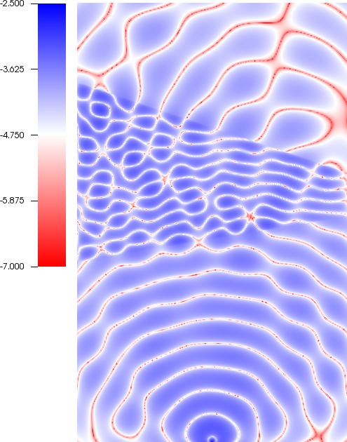
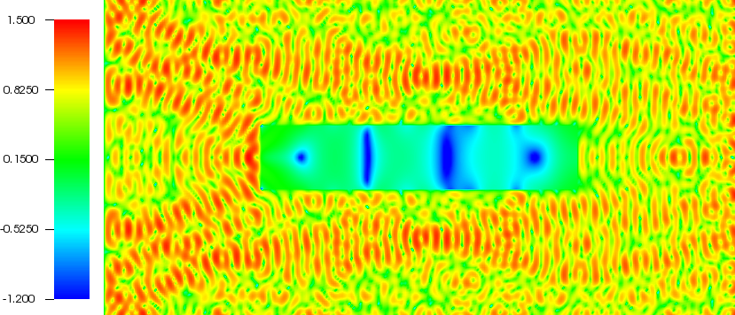
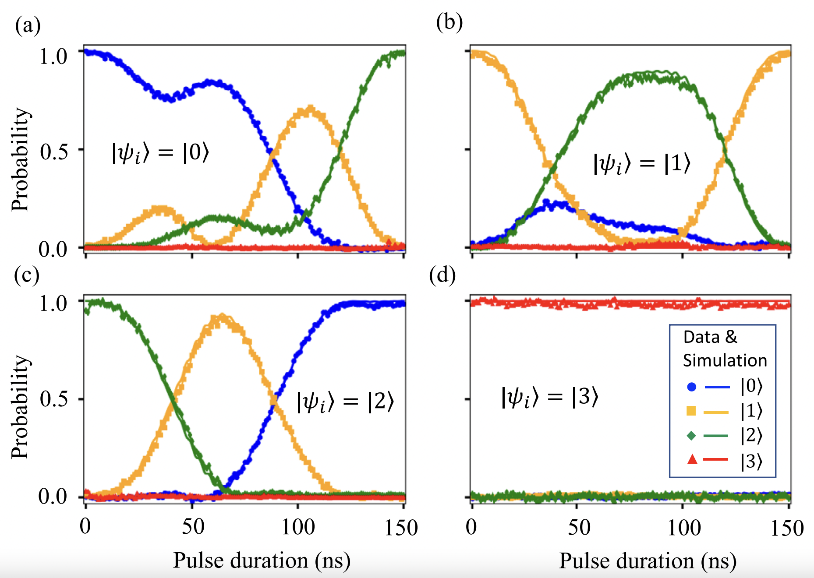

A complete list of publications is available on my [Google Scholar page](https://scholar.google.com/citations?user=4-LEq38AAAAJ&hl=en), or on my [CV](../files/Fortino_Garcia_CV.pdf). All preprints are also available on [arXiv](https://arxiv.org/a/garcia_f_1.html).

My research interests are broadly in numerical methods for linear PDEs, scientific computing, and optimization. More specifically, my research focuses on numerical methods for problems related to wave propagation primarily in two main areas: 
- [Time-domain approaches for Helmholtz problems](#time-domain-approaches-for-helmholtz-problems)
- [Optimal control for quantum systems](#optimal-control-for-quantum-systems)

I gratefully acknowledge the support of the NSF (DMS-1913076 and DMS-2103382) as well as STINT initiation grant IB2019–8154 in making this work possible. 

## Time-domain approaches for Helmholtz problems

For many applications in seismology, optics, and  acoustics it is important to find solutions of the time-dependent wave equation that are periodic in the limit as time goes to infinity (which are commonly called *time-harmonic solutions*). Rather than solve the wave equation forward in time to obtain this solution it is common to instead solve the *Helmholtz equation* which is a second order time-independent PDE. The Helmholtz equation is notoriously difficult to solve by direct or iterative methods due to the resolution requirements and the indefinite nature of the differential operator, especially at high frequencies. This has lead to a very rich and active research area in designing preconditioners and direct solvers for the Helmholtz equation (which you can read more about [here](https://www.unige.ch/~gander/Preprints/HelmholtzReview.pdf)).

Rather than working with the Helmholtz equation directly, we instead propose going back to the time-domain to seek time-harmonic solutions of the wave equation in an iterative fashion. This method, which we have named the WaveHoltz iteration, instead seeks to find a fixed point of an operator that takes a time-average of a wave equation solution over a single period. What is remarkable about our method is that it *results in a positive definite system* whereas the Helmholtz problem may be indefinite, is *scalable and memory-lean* since it exploits wave equation solves as its main workhorse, and is *simple to apply to other models* such as damped wave equations or even [Maxwell's equations](https://ieeexplore.ieee.org/abstract/document/9743767). For instance, below we plot the log of the real part of the Helmholtz solution for a point source inside of a wedge with discontinuous wavespeeds and impedance (outflow) boundary conditions.

WaveHoltz can be extended in a straightforward way to solve the *Navier* or *Navier-Cauchy* equation (not to be confused with the ubiquitous Navier-Stokes equation!) which is the elastic analogue of the Helmholtz equation. Below is a log plot of the magnitude of the solution of the Navier equation for an elastic inclusion (perhaps more recognizable as the cover image of a [certain book](https://www.cambridge.org/core/books/finite-volume-methods-for-hyperbolic-problems/97D5D1ACB1926DA1D4D52EAD6909E2B9)) obtained using the WaveHoltz iteration.

The above work has been done in collaboration with [Daniel Appelö](https://sites.google.com/msu.edu/danielappelo), [Olof Runborg](https://www.csc.kth.se/~olofr/), and Allen Alvarez Loya.

### Selected relevant papers:

- [WaveHoltz: Iterative Solution of the Helmholtz Equation via the Wave Equation](https://epubs.siam.org/doi/abs/10.1137/19M1299062)
- [El-WaveHoltz: A Time-Domain Iterative Solver for Time-Harmonic Elastic Waves](https://arxiv.org/abs/2205.12344)
- [Extensions and Analysis of an Iterative Solution of the Helmholtz Equation via the Wave Equation](https://arxiv.org/abs/2205.12349)

[Back to top](#top)

## Optimal Control for quantum systems
This work, done in collaboration with [Anders Petersson](https://people.llnl.gov/petersson1) at Lawrence Livermore National Laboratory (LLNL), focuses on numerical methods for optimal control of quantum systems. The motivation of this project was a need of the [Quantum Coherent Device Physics Group](https://pls.llnl.gov/research-and-development/physics/quantum-coherent-device-physics-group) at LLNL for efficient software capable of generating high-fidelity quantum logic gates. Specifically, our approach was co-designed by the quantum group at LLNL to be faster and more robust than competing quantum control software, such as QuTiP, at finding control signals that perform logic gates on superconducting qubits. The evolution of these superconducting qubits is governed by the ODE Schrödinger equation which can be derived by diagonalizing the original Schrödinger PDE in space.

A distinguishing feature of our approach is that the number of control parameters defining the control is independent of the number of timesteps needed, which is in contrast to the customary GRAPE algorithm. This decoupling is achieved by expanding each control in a B-spline basis with carrier waves, thus allowing precise triggering of transition frequencies of the system using a small number of control parameters. This expansion yields a physically motivated continuous approximation of the control and, in tandem with a discretize-then-optimize approach, we leverage the symplectic and time-reversible Störmer-Verlet scheme to compute exact discrete gradients. The gradient is computed using the adjoint-state method, and the unitary evolution of Schrödinger coupled with the time-reversibility of the Störmer-Verlet scheme gives a memory-lean method.

The resulting optimal control software, for which I am a primary developer, is a package written in the [Julia](https://julialang.org/) programming language and is named [JuQBox](https://github.com/LLNL/Juqbox.jl). Preliminary numerical results indicate JuQBox can be orders of magnitudes (in some cases up to 300x) faster than competing software using GRAPE. Moreover, few parameters are needed to achieve gate fidelities of 99.9% or greater which affords JuQBox scalability to much larger problems. The successful co-design of JuQBox has allowed the quantum group at LLNL to acquire control signals realizing an experimental fidelity of up to 99.4%, shown below (with more details [here](https://journals.aps.org/prl/abstract/10.1103/PhysRevLett.125.170502)).

### Selected relevant paper(s):
- [Optimal Control of Closed Quantum Systems via B-Splines with Carrier Waves](https://arxiv.org/abs/2106.14310)

[Back to top](#top)